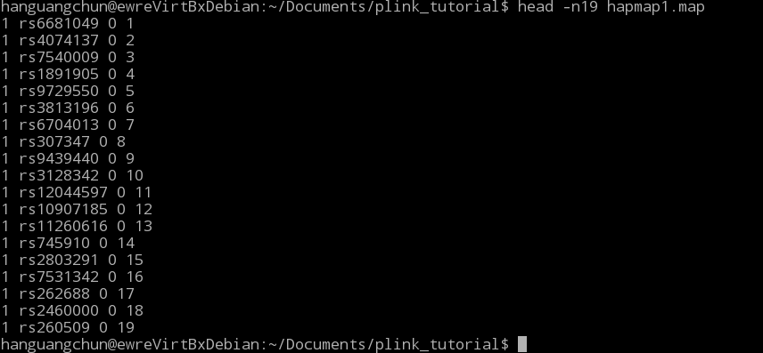
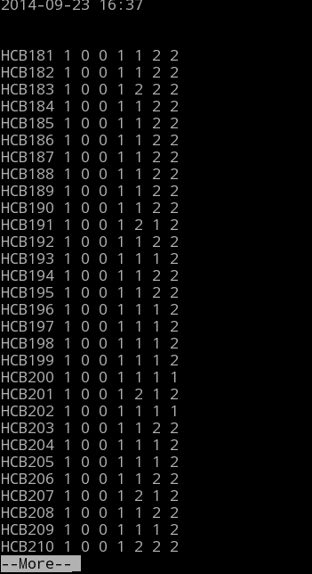
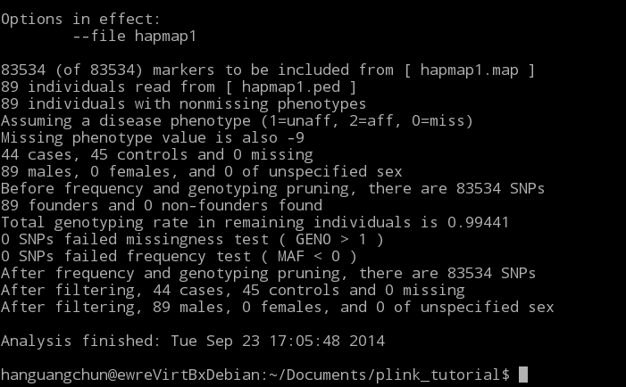
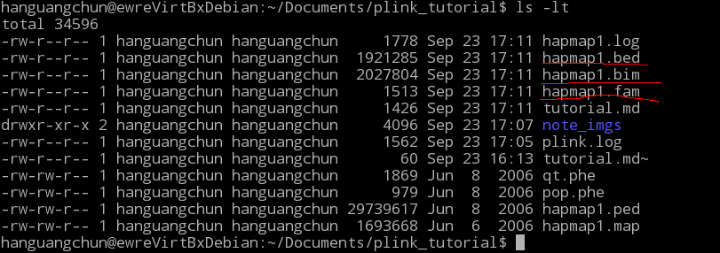
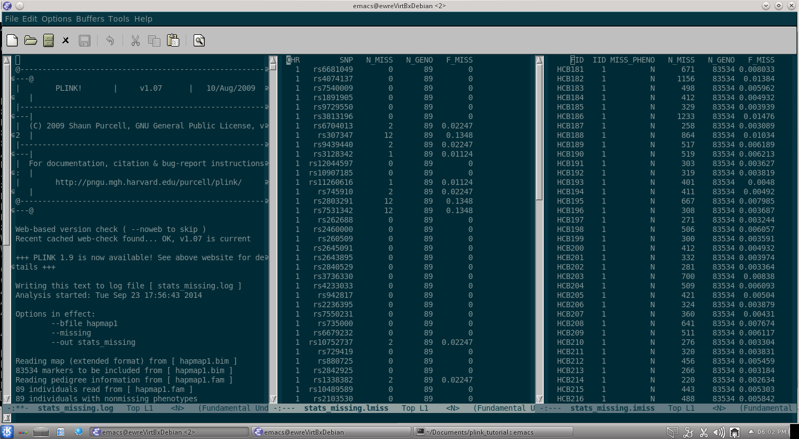
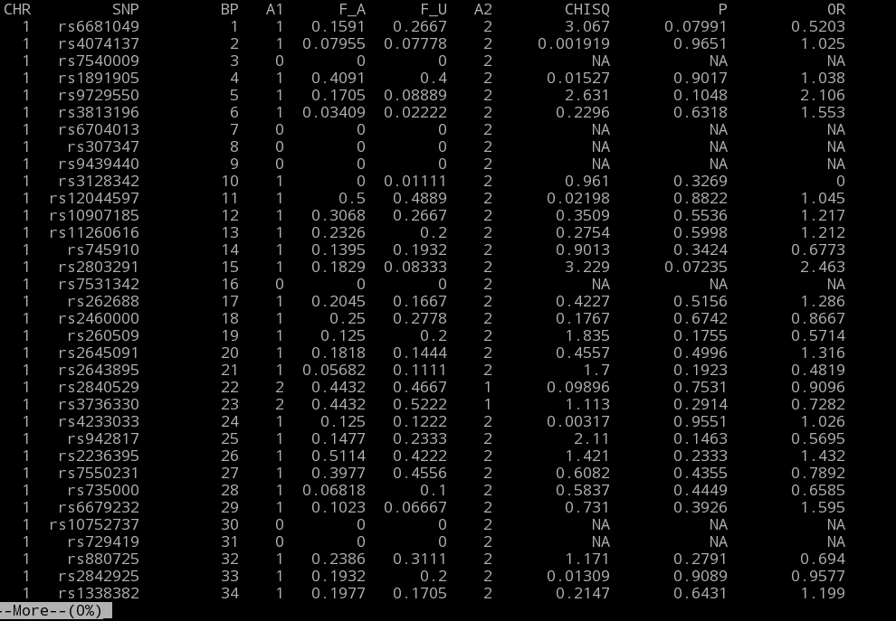
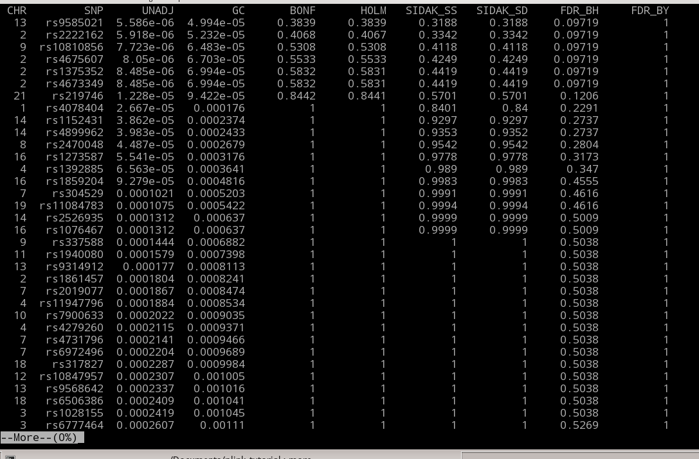

# tutorial from the [official website](http://pngu.mgh.harvad.edu/~prucell/plink/tutorials.shtml) of plink  

* about plink data file format
  * prj.map
	map file contains the markers being researched. it is a 4 columns file with the format:
	- chr
	- snp rsID
	- genetic distance
	  this field is excluded by the command flag __--map3__
		  plink --file mydata --map3
	- postion
	here follows an example of a map file:
	
	
  * prj.ped
	ped file is filled with:  
		- pedigree information   
		  - family ID  
		  - indiv ID  
		  - paternal ID  
		  - maternal ID  
		  - sex  
		  - phenotype  
			+ qutantitive or categorial;one and only one  
			+ -9, 0, 1,2 encoded by default; if 0/1 coded, use:  
			  plink --file mydata --1  
		- snp information(genotypes)  
		  - 0, by default, represents missing genotype(changed with --missing-genotype X)  
		  - __all variants must be biallelic__  
		- when some fields are missing(working with basic ped file __ONLY__):  
		  - --no-fid  
			no family ID column, all samples will have the sample fid  
		  - --no-parents  
			paternal and mathernal columns omitted  
		  - --no-sex: all samples will have missing sex code  
		  - --no-pheno  
		
		  
  * xxx.phe  

* load project file   
  plink --file hapmap1  
  

* make binary ped file__
  plink --file hapmap1 --make-bed --out hapmap1  
    

* working with binart file
  plink --bfile hapmap1

* missing stats(genotyping rates)  
  plink --bfile hapmap1 --missing --out stats_missing  
  command above show missing rate per locus(lmissing)/individual(imissing)  
  

* allele frequency
  plink --bfile hapmap1 --freq --within pop.phe --out alleleFreqWithinPop
  
  here, MAF=MAC/NCHROBS

* association test
  plink --bfile hapmap1 --assoc --out as1
    
  to correct for multiple testing:  
  plink --bfile hapmap1 --assoc --adjust --out as1.adj  
  

